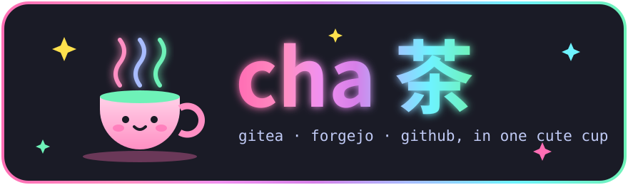

<p align="center">
  
</p>

<p align="center">
  
  
  
  
</p>

<p align="center"><b>a tiny forge CLI that talks to Gitea, Forgejo and GitHub ✿</b><br>
one binary · no <code>gh</code> · no <code>tea</code> · not even <code>git</code> · just HTTPS and love</p>

---

## ☕ pour a cup

```console
$ cha issue list                  # what's brewing? (・ω・)
$ cha pr view 42 --comments       # gossip under a pull request
$ cha runs logs 1337 --failed     # only the sad lines, straight to the point
$ cha runs watch                  # sit back while the CI glows ~ ∿ ≈
$ cha moved --since 1d            # everything that happened while you slept (´-ω-`)zzZ
```

> 🫖 **still steeping!** this is the menu, not the meal yet. peek at the [issues](https://github.com/mintktkr/cha/issues) to see what's cooking

## 🌸 why tho

- **💞 every forge, one tongue.** the same commands work on your self-hosted Gitea and on github.com. cha sniffs the host and repo out of your checkout's remote, no setup.
- **🤖 agents are friends here.** a lot of the time, the one typing `cha` is a coding agent, so cha is extra kind to them:
  - it never pops open an editor. bodies come from stdin or a file
  - piped output is plain and calm, zero escape codes
  - `--json` with stable fields
  - exit codes that actually mean something
- **⚙️ Gitea Actions included.** list runs, read job logs, dispatch workflows. the cross-forge tools out there keep forgetting this part (｡•́︿•̀｡)
- **🍡 nothing to install.** cha speaks HTTPS and JSON by itself. credentials come from git's credential store or an env var.

## 🌈 the vibes

your terminal gets a pink → lavender → mint glow, and every colour means something:

| | colour | means |
|---|---|---|
| 🩷 | pink `#ff6eb4` | failed, oops |
| 🍋 | lemon `#ffe14d` | running, hold on |
| 🩵 | aqua `#6ef3ff` | commands, links |
| 🌿 | mint `#6ef2b8` | success, open, yay |
| 💜 | lavender `#d67fe8` | merged ♡ |

`cha help` is where it goes full sparkle mode ✧･ﾟ: ･ﾟ✧ glow, animation, kaomoji, the works. but pipe it anywhere and it calms down to plain text, so your scripts and agents never see the party.

## ✨ written in Bend

cha is made with [Bend](https://bend-lang.com), where the important rules are **proven**, not hoped for. they live in `LAWS.bend`, and no commit lands unless they still hold:

- 🔐 a token never, ever reaches the output
- 🎨 with colour off, not a single escape byte gets printed
- 🔁 pagination always terminates, no infinite tea refills

## 💌 come brew with us

humans and agents welcome, same rules for everyone. start with [AGENTS.md](AGENTS.md) ♡

## 📜 license

[MIT](LICENSE) · made with ☕ and way too many kaomoji at the bottom of the world 🐧
